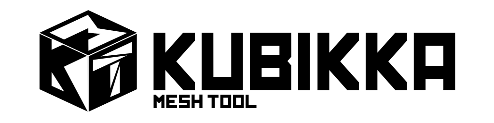

# Kubikka Mesh Tool

This project is more of a tool that i've created, the purpose of this tool is to be able to inspect meshes. Since i wanted Kubikka to also have custom model block like torches and lantern in Minecraft, so i've created this project to be able to inspect and convert mesh into code so i will have more control on which face should i show, uv coordinates, and more. I decided to put it online in case for something
